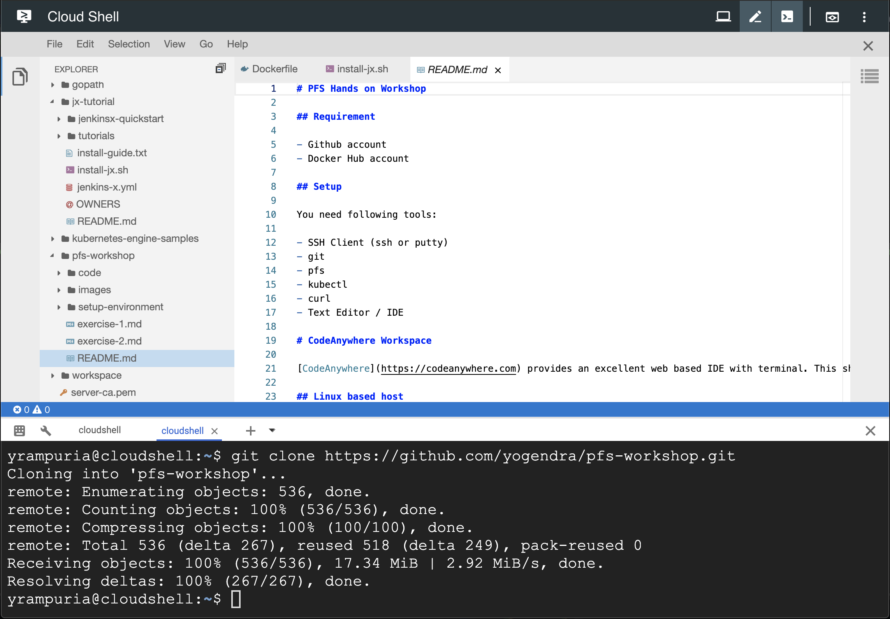
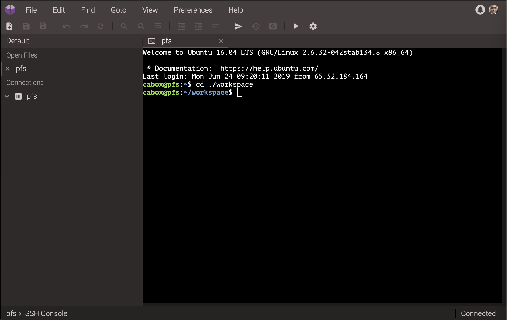

# Pivotal Function Service (PFS) Hands on Workshop

[Product Page](http://pivotal.io/pfs) | [Knative](https://knative.dev/) | [Kubernetes](https://kubernetes.io/)

This workshop will get a short and quick introduction to serverless programmin using PFS. PFS is based on knative.

- K8s is Kubernetes
- Knative is Kubernetes based serverless framework
- Istio is a service mesh framework. It was initially designed for Kubernetes, but it can be used on other container platforms, example Cloud Foundry / Pivotal Application Service
- Knative uses Istio to manage routing
- PFS is based on Knative. It adds:
  - Builds via [Cloud Native Buildpack](https://buildpack.io)
  - Spring Invoker


## Requirement

- [Github account](https://github.com)
- Linux environment
- _(Optional)_ [Codeanywhere Account](https://codeanywhere.com/)
- _(Optional)_ [Google Cloud Platform Account](https://cloud.google.com/)

## Setup

You will need following tools to complete exercises in this workshop:

- Linux or Mac environment (required)
- git
- kubectl
- pfs
- curl
- Text Editor / IDE

If you do not have a linux/mac based machine, you can use one of the cloud based workspace.

## Cloud Workspace: Google Cloud Shell

Google Cloud provides a very good browser based shell. It is free to use. You will need a Google account to access cloudshell.
Just go to [Google Cloud Console - Cloudshell](https://console.cloud.google.com/cloudshell/editor) and follow the instructions to start cloud shell.



Ones you are in the shell, follow instruction in the [Linux based host](#linux-based-host) section of this page to finish setup.

## Cloud Workspace: CodeAnywhere

[CodeAnywhere](https://codeanywhere.com) provides an excellent web based IDE with terminal. This should sufficient for our usage. Just go through the signup process. You will need to verify you email in order to start using the workspace.

1. Signup using you email, github or any other social account
1. Verify you email
1. Create a workspace and call it pfs
1. Run the setup commands in the [Linux based host](#linux-based-host) section to finish setting



## Linux based host

- Setup kubectl (skip for GCP cloudshell)

  ```
  curl -sLO https://storage.googleapis.com/kubernetes-release/release/$(curl -s https://storage.googleapis.com/kubernetes-release/release/stable.txt)/bin/linux/amd64/kubectl
  chmod a+x kubectl
  sudo mv kubectl /usr/local/bin
  kubectl completion bash | sudo tee /etc/bash_completion.d/kubectl > /dev/null
  ```

  **OR on Mac**

  ```
  curl -sLO https://storage.googleapis.com/kubernetes-release/release/$(curl -s https://storage.googleapis.com/kubernetes-release/release/stable.txt)/bin/darwin/amd64/kubectl
  chmod a+x kubectl
  sudo mv kubectl /usr/local/bin
  ```

* Setup pfs

  ```
  curl -sLO https://github.com/yogendra/pfs-workshop/raw/master/setup-environment/bin/pfs.linux
  chmod a+x pfs.linux
  sudo mv pfs.linux /usr/local/bin/pfs
  pfs completion bash | sudo tee /etc/bash_completion.d/pfs > /dev/null

  ```

  **OR on Mac**

  ```
  curl -sLO https://github.com/yogendra/pfs-workshop/raw/master/setup-environment/bin/pfs.darwin
  chmod a+x pfs.darwin
  sudo mv pfs.darwin /usr/local/bin/pfs

  ```

* Fetch Kuberentes config for workshop.

  ```
  # Change this to you own user id given by the instructor
  export WS_USER=CHANGE_ME
  ```

  _Following lines can be copy pasted_

  ```
  mkdir -p $HOME/.kube
  [[ -e $HOME/.kube/config ]] && cp $HOME/.kube/config $HOME/.kube/config.original
  curl -sL https://github.com/yogendra/pfs-workshop/raw/master/setup-environment/users/$WS_USER/config -o $HOME/.kube/config

  ```

  > **TIP:** Use [Cheatsheet](cheatsheet.md) for setting up your shell now or later at any point

## Test Workspace Setup

To check that you environment is configured properly, you may run following commands.

```
> kubectl cluster-info
Kubernetes master is running at https://pfs-workshop-k8s.atwater.cf-app.com:8443
CoreDNS is running at https://pfs-workshop-k8s.atwater.cf-app.com:8443/api/v1/namespaces/kube-system/services/kube-dns:dns/proxy

To further debug and diagnose cluster problems, use 'kubectl cluster-info dump'.
```

```
> pfs service list
```

## Exercises

[Simple Function](exercise-1.md)

[Java and JS Based Functions](exercise-2.md)

## Setup Your Own

You can set up your own environment you can follow the step in the PFS documentation. My personal experience on `minikube` and _Docker for Desktop_ is very positive. I would recommend using them.

- [PFS 0.1.0](https://docs.pivotal.io/pfs/0-1/) Documentation ([Next Version](https://docs.pivotal.io/pfs/0-2/))
- [Knative](https://knative.dev/docs/) Documentation
